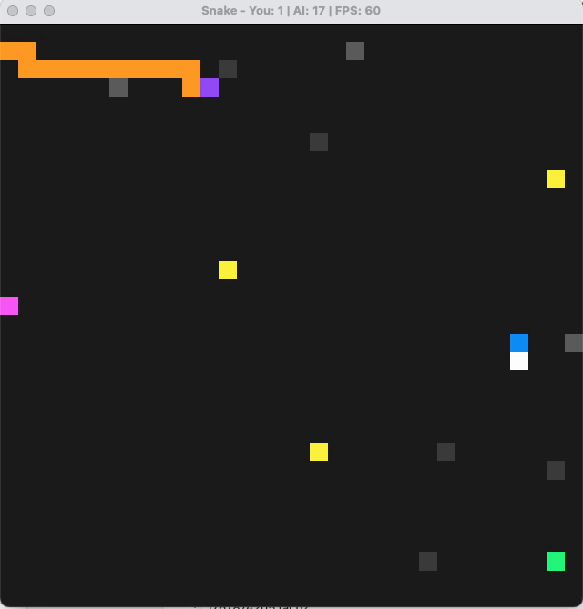

# Snake Game - Enhanced Edition

My capstone project for the [Udacity C++ Nanodegree](https://www.udacity.com/course/c-plus-plus-nanodegree--nd213). I took the starter Snake game and added a bunch of new features to demonstrate what I learned throughout the program.



## What I Added

### High Score System
When you start the game, it asks for your name and shows you the current top 5 scores. After each game, your score gets saved to `highscores.txt` so you can track your progress over time.

### Different Food Types
Instead of just one type of food, there are now four different kinds that spawn randomly:

| Color | Type | Points | Effect |
|-------|------|--------|--------|
| Yellow | Normal | +1 | Small speed increase |
| Red | Speed Boost | +2 | Larger speed increase |
| Cyan | Slowdown | +1 | Decreases your speed |
| Pink | Bonus | +5 | No speed change |

Multiple food items appear on the screen at once (up to 5), and new ones spawn every few frames.

### Obstacles
The game now has obstacles you need to avoid:
- **Dark gray blocks** - Fixed obstacles that don't move
- **Light gray blocks** - Moving obstacles that follow horizontal, vertical, or circular patterns

Hit an obstacle and it's game over.

### AI Opponent (Optional)
At the start, you can choose to play against an AI snake. If you enable it:
- **Your snake**: Blue head, white body
- **AI snake**: Purple head, orange body

The AI uses A* pathfinding to chase food and runs its calculations in a separate thread so it doesn't slow down the game. It's actually pretty competitive!

## How to Play

- **Arrow keys** to move
- Eat food to grow and score points
- Avoid obstacles, the AI snake (if enabled), and your own tail
- Close the window to quit

## Building the Game

You'll need:
- cmake (3.7+)
- make
- SDL2
- g++ (5.4+)

```bash
mkdir build && cd build
cmake .. && make
./SnakeGame
```

### Installing SDL2

**Mac**: `brew install sdl2`

**Ubuntu/Debian**: `sudo apt-get install libsdl2-dev`

**Windows**: Download from [SDL2 releases](https://github.com/libsdl-org/SDL/releases)

## Project Structure

```
src/
├── main.cpp          # Entry point, game setup
├── game.h/cpp        # Core game loop and logic
├── snake.h/cpp       # Base snake class
├── ai_snake.h/cpp    # AI snake with A* pathfinding
├── food.h/cpp        # Food types (inheritance hierarchy)
├── obstacle.h/cpp    # Obstacle system (smart pointers, Rule of 5)
├── highscore.h/cpp   # Score persistence
├── renderer.h/cpp    # SDL2 rendering
└── controller.h/cpp  # Keyboard input
```

## Rubric Points

Here's where I addressed each rubric requirement:

### Loops, Functions, I/O

| Requirement | Where to Find It |
|-------------|------------------|
| Reads data from file | `highscore.cpp` - LoadScores() |
| Writes data to file | `highscore.cpp` - SaveScores() |
| Accepts user input | `highscore.cpp` - GetPlayerName(), `main.cpp` - AI enable prompt |

### Object Oriented Programming

| Requirement | Where to Find It |
|-------------|------------------|
| Appropriate access specifiers | All new classes (`food.h`, `obstacle.h`, `ai_snake.h`) |
| Member initialization lists | `food.cpp`, `obstacle.cpp`, `ai_snake.cpp` constructors |
| Abstract base classes | `Food` and `Obstacle` base classes with pure virtual methods |
| Inheritance hierarchy | Food types inherit from Food, Obstacle types inherit from Obstacle |
| Virtual function overrides | `ApplyEffect()`, `GetColor()` in food classes; `Update()` in obstacle classes |
| Templates | `CreateFood<T>()` template function in `food.h` |

### Memory Management

| Requirement | Where to Find It |
|-------------|------------------|
| Pass-by-reference | Throughout `game.h`, `obstacle.h`, `ai_snake.h` |
| Destructors | `obstacle.cpp`, `ai_snake.cpp` - clean up resources |
| RAII | `ObstacleManager` and `AISnake` - resources managed by object lifetime |
| Rule of 5 | `Obstacle` class - copy/move constructors and assignment operators |
| Smart pointers | `std::unique_ptr` for Food and Obstacle objects in `game.h` |

### Concurrency

| Requirement | Where to Find It |
|-------------|------------------|
| Multithreading | `ai_snake.cpp` - PathfindingThread runs A* in background |
| Mutex | `ai_snake.h/cpp` - protects shared game state |
| Condition variable | `ai_snake.h/cpp` - signals when new path is needed |
| Promise/future | `ai_snake.h/cpp` - passes path results between threads |

## License

This project is licensed under [CC BY-SA 4.0](http://creativecommons.org/licenses/by-sa/4.0/).

[![CC BY-SA 4.0][cc-by-sa-image]][cc-by-sa]

[cc-by-sa]: http://creativecommons.org/licenses/by-sa/4.0/
[cc-by-sa-image]: https://licensebuttons.net/l/by-sa/4.0/88x31.png
